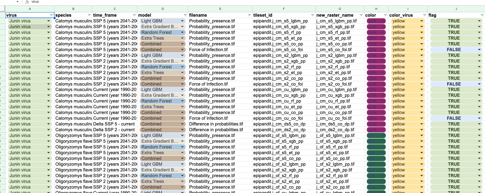

# Data process

These scripts are responsible for preparing the data for mapbox. Download the `data` folder and pasting it into `data/raw`

The folder structure must follow the order of `virus`, `species`, `time frame`, `model`, and the `.tif` file, as shown in the following scheme:

```shell

├── Dockerfile
├── README.md
├── data
│   ├── raw
│   │    ├── [VIRUS NAME]
│   │    │   ├── [SPECIE NAME]
│   │    │   │   ├── [TIME FRAME NAME]
│   │    │   │   │   ├── [MODEL NAME]
│   │    │   │   │   │   ├── [FILENAME].tif
│   ├── ...
│
├── name_equivalence.json
├── requirements.txt
├── run.sh
└── src
    ├── __init__.py
    └── pre_process.py

```


Given the large number of folders and file names, we use the `name_equivalence.json` file, which defines a object of equivalences for standardization.

Each key in this file represents a folder name, and its value is a dictionary containing the abbreviation (`short`), the name used in spreadsheets (`spreadsheet`), and the associated color (`color`).

```json
{
  "Guanarito_virus": {
    "short": "g",
    "spreadsheet": "Guanarito virus",
    "color": "blue"
  },
  "Junin_virus": {
    "short": "j",
    "spreadsheet": "Junin virus",
    "color": "yellow"
  },
  ...
}
```

## Upload files to Mapbox

1. Create [docker](https://docs.docker.com/engine/install/) image

```shell
docker compose build
```

2. Export credentials from [mapbox](https://docs.mapbox.com/help/getting-started/access-tokens/)

```shell
export ACCESS_TOKEN=
export MAPBOX_USER=
```

3. Run script

```shell
bash process_tif.sh
```

The output of this script generates an `to_upload` folder inside `data`, where the processed and renamed `.tif` files are stored. Additionally, a `CSV` file named `data_output_tiff.csv` is created.

This CSV serves as raw data to update the spreadsheet and contains the structure and combination of files and folders, along with the `.tif` ID in Mapbox.

```csv
virus,species,time_frame,model,filename,tileset_id,new_raster_name,color,color_virus
Junin virus,Calomys musculinus,SSP 5 (years 2041-2060),Light GBM,Probability_presence.tif,USERR.j_cm_s5_lgbm_pp,j_cm_s5_lgbm_pp.tif,pink,yellow
Junin virus,Calomys musculinus,SSP 5 (years 2041-2060),Extra Gradient Boost,Probability_presence.tif,USERR.j_cm_s5_xgb_pp,j_cm_s5_xgb_pp.tif,pink,yellow
Junin virus,Calomys musculinus,SSP 5 (years 2041-2060),Random Forest,Probability_presence.tif,USERR.j_cm_s5_rf_pp,j_cm_s5_rf_pp.tif,pink,yellow
Junin virus,Calomys musculinus,SSP 5 (years 2041-2060),Extra Trees,Probability_presence.tif,USERR.j_cm_s5_et_pp,j_cm_s5_et_pp.tif,pink,yellow

```



## Generate Hot-sports file

To process hotspots, the shapefiles must first be downloaded into the `data/Vector_Force_of_infection_hotspots` folder, and then the `process_hotspots.sh` script should be executed.

This script will generate a `hotspots.geojson.gz` file inside the `data/Vector_Force_of_infection_hotspots/` folder. This file is a filtered version containing only points with equivalence values compatible with the application.

Finally, the `data/Vector_Force_of_infection_hotspots/hotspots.geojson.gz` file must be copied into the `web_app/public/assets/data/hotspots.geojson.gz` folder within the web application.

```shell
bash process_hotspots.sh
```
