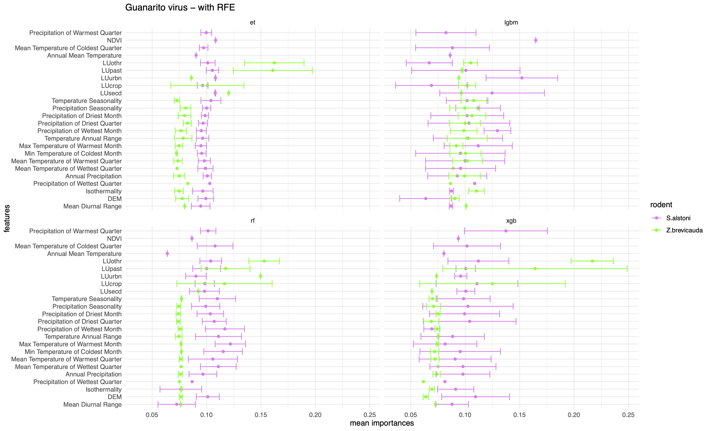
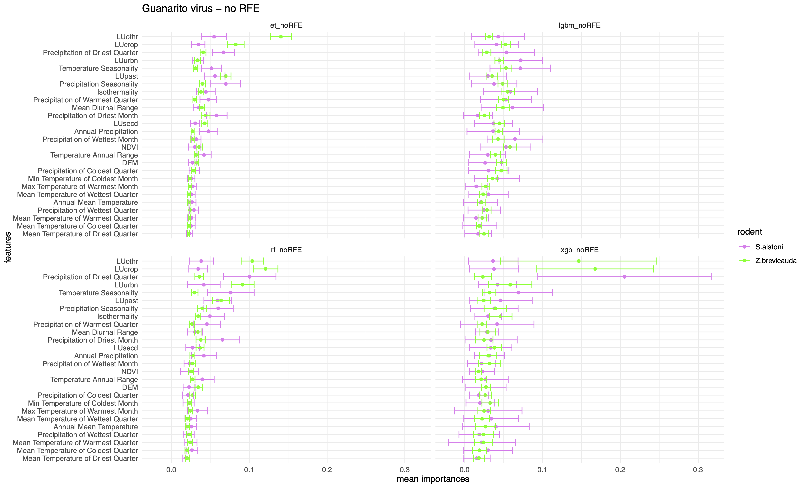

# Guanarito virus

Guanarito virus is the causal agent of Venezuelan Hemorrhagic Fever (VHF), a zoonotic viral disease, in humans. Found first in rural Venezuela, Guanarito virus was named after the city of Guanarito where it was found in Portuguese province of Venezuela in 1988-1990. Being a zoonotic arenavirus, it is primarily rodent-borne and has confirmed reservoir of [Short-tailed cane mouse](Zygodontomys brevicauda.md) (_Zygodontomys brevicauda_). Another potential reservoir [Alston's Cotton rat](Sigmodon Alstoni.md) (_Sigmodon alstoni_) has been implicated in spreading Guanarito virus and its close-relative, [Pirital virus](https://doi.org/10.4269/ajtmh.1997.56.548). VHF is can be severe in some cases with an estimate of 25% mortality just like Argentine Hemorrhagic fever (AHF) and Lassa Fever (LF) which are also caused by arenaviruses. The most risk-prone groups include migrant agricultural workers (mostly male) and their families. The [last reported outbreak](<https://doi.org/10.1016/0140-6736(91)91899-6>) was seen in early 1990s.

## Species distribution models for reservoirs of Guanarito virus

We conducted a study to (i) model the species distribution of the two rodent species, namely, _Z. brevicauda_ and _S. alstoni_ using climate-driven features such as [bioclimatic features](https://www.worldclim.org/data/bioclim.html), [land use](https://lcluc.umd.edu/), [NDVI](https://modis.gsfc.nasa.gov/data/dataprod/mod13.php), and [elevation/ topography](https://portal.opentopography.org/datasetMetadata?otCollectionID=OT.032021.4326.2) and (ii) attempt to predict how the species distribution will change in response to changes in the climate-driven features in the future based on climate change scenarios derived from [CMIP6](https://www.carbonbrief.org/cmip6-the-next-generation-of-climate-models-explained/#:~:text=model%20sensitivity%20values.-,Future%20warming%20in%20CMIP6,-The%20limited%20number). More specifically, [the moderate climate change scenario or SSP2.45 and severe climate change scenario or SSP5.85](https://www.carbonbrief.org/explainer-the-high-emissions-rcp8-5-global-warming-scenario/#:~:text=The%20new%20SSP%20scenarios).

Each species was found to be sensitive to different features and the changes therein. Following figure shows the feature importances based on the mean reduction in impurity of the classification algorithms (a) with Recursive Feature Selection([RFE](https://scikit-learn.org/dev/modules/generated/sklearn.feature_selection.RFE.html)) and (b) without [RFE](https://scikit-learn.org/dev/modules/generated/sklearn.feature_selection.RFE.html).

  

    

  
