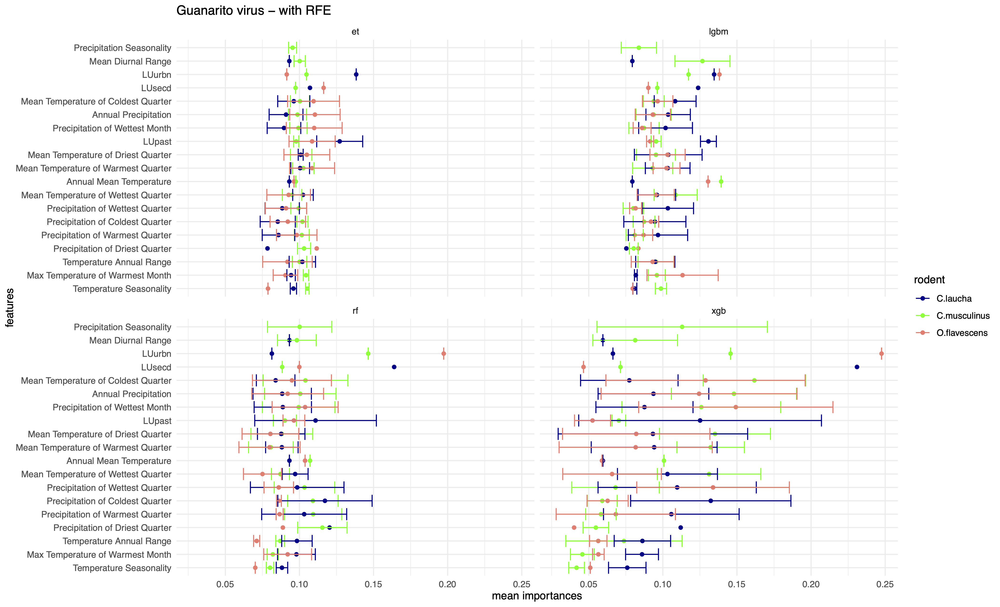
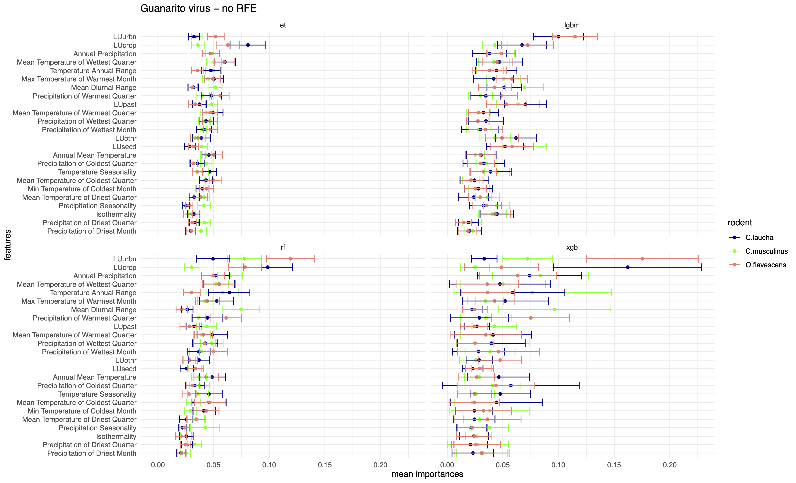

# Junin Virus

Junin mammarenavirus (JUNV) or commonly known as Junin virus is the etiological agent of Argentine Hemorrhagic Fever (AHF) in humans. This disease is endemic to the humid pampas in Argentina, a densely populated area at the core of the largest agro-industrial complex in the country. In severe cases of AHF, patients develop hemorrhagic and neurological complications, with a fatality rate of 20%. In the last 10 years, [the virus spread has expanded to northeastern Argentina](https://www.biorxiv.org/content/10.1101/2024.06.24.600371v1), with recent reemergence in areas that had not had cases for 15-20 years. JUNV is a RNA virus that spreads in humans through rodent reservoirs such as _Calomys musculinus_ ([Dryland Vesper Mouse](resources/calomys_musculinus)), _Calomys laucha_ ([Small Vesper mouse](resources/calomys_laucha)) and _Oligoryzomys flavescens_ ([Yellow Pygmy Rice Rat](resources/oligoryzomys_flavescens)).

## Species distribution models for reservoirs of Guanarito virus

We conducted a study to (i) model the species distribution of the three rodent species, namely, _C. musculinus_, _C.laucha_ and _O.flavescens_ using climate-driven features such as [bioclimatic features](https://www.worldclim.org/data/bioclim.html), [land use](https://lcluc.umd.edu/), and (ii) attempt to predict how the species distribution will change in response to changes in the climate-driven features in the future based on climate change scenarios derived from [CMIP6](https://www.carbonbrief.org/cmip6-the-next-generation-of-climate-models-explained/#:~:text=model%20sensitivity%20values.-,Future%20warming%20in%20CMIP6,-The%20limited%20number). More specifically, [the moderate climate change scenario or SSP2.45 and severe climate change scenario or SSP5.85](https://www.carbonbrief.org/explainer-the-high-emissions-rcp8-5-global-warming-scenario/#:~:text=The%20new%20SSP%20scenarios).

Each species was found to be sensitive to different features and the changes therein. Following figure shows the feature importances based on the mean reduction in impurity of the classification algorithms (a) with Recursive Feature Selection([RFE](https://scikit-learn.org/dev/modules/generated/sklearn.feature_selection.RFE.html)) and (b) without [RFE](https://scikit-learn.org/dev/modules/generated/sklearn.feature_selection.RFE.html).

  

    

  
