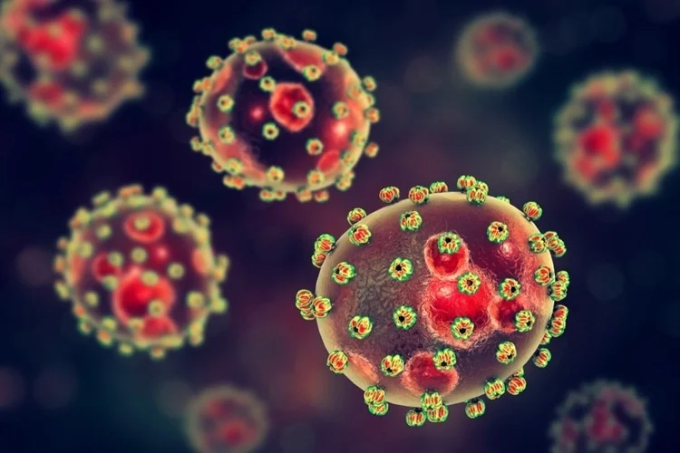

# About the the virus

Junin mammarenavirus (JUNV) or commonly known as Junin virus is the etiological agent of Argentine Hemorrhagic Fever (AHF) in humans. This disease is endemic to the humid pampas in Argentina, a densely populated area at the core of the largest agro-industrial complex in the country. In severe cases of AHF, patients develop hemorrhagic and neurological complications, with a fatality rate of 20%. In the last 10 years, the virus spread has expanded to northeastern Argentina, with recent reemergence in areas that had not had cases for 15-20 years. JUNV is a RNA virus that spreads in humans through rodent reservoirs such as Calomys musculinus, Calomys laucha and Oligoryzomys flavescens.

## map

<iframe id="test"  style=" height:400px; width:100%;" scrolling="no"  frameborder="0" src="https://leafletjs.com/examples/quick-start/example.html"></iframe>

<h3> text html</h3>
