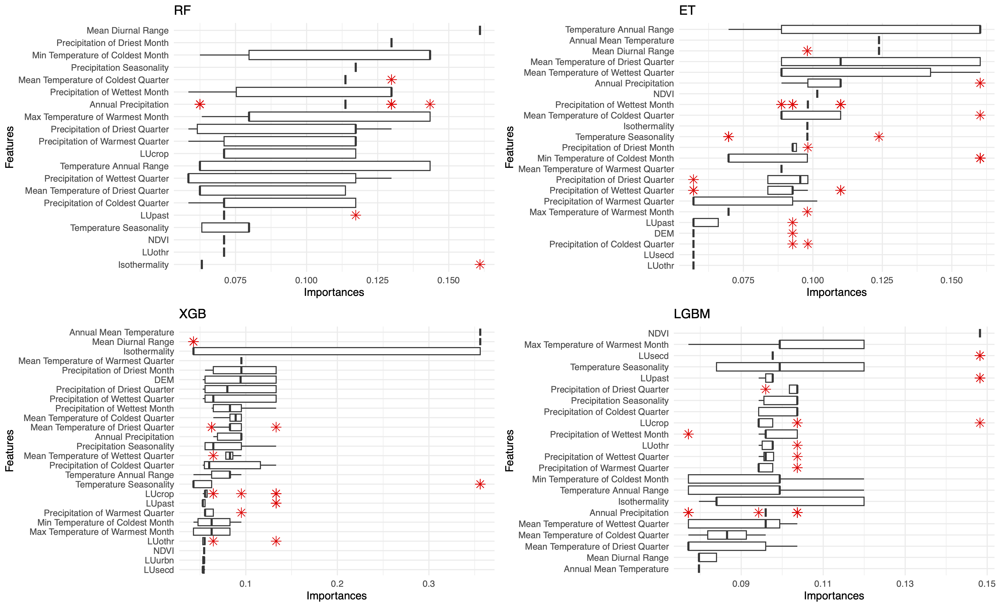
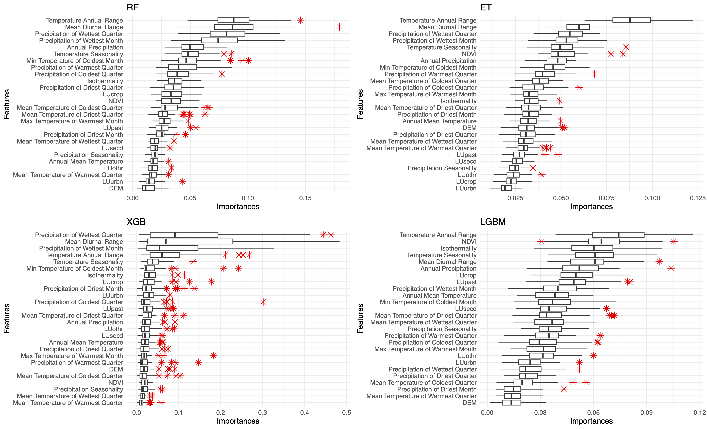

# Machupo virus

## Causal Agent of:
Bolivian Hemorrhagic fever

## History
Endemic to Bolivia, Machupo virus, like its close relatives [Junin virus](resources?item=junin_virus), [Guanarito virus](resources?item=guanarito_virus) and Chapare virus, is one of the main New World Arenaviruses that cause hemorrhagic fever. The disease is severe and can lead to a case-mortality rate of 25-35% with acute symptoms but may also lead to debilitating chronic viraemia. The [first reported outbreak was in early 1960s and the latest was reported in early 1990s](https://doi.org/10.1016/j.vetmic.2009.08.027). Recently, sporadic and isolated cases have been reported across Bolivia due to changes in human-rodent interactions.

## Reservoir
_Calomys callosus_ ([large vesper mouse](resources?item=calomys_callosus))

We conducted a study to (i) model the species distribution of the rodent species, _Calomys callosus_ using climate-driven features such as [bioclimatic features](https://www.worldclim.org/data/bioclim.html), [land use](https://lcluc.umd.edu/), [NDVI](https://modis.gsfc.nasa.gov/data/dataprod/mod13.php), and [elevation/ topography](https://portal.opentopography.org/datasetMetadata?otCollectionID=OT.032021.4326.2) and (ii) attempt to predict how the species distribution will change in response to changes in the climate-driven features in the future based on climate change scenarios derived from [CMIP6](https://www.carbonbrief.org/cmip6-the-next-generation-of-climate-models-explained/#:~:text=model%20sensitivity%20values.-,Future%20warming%20in%20CMIP6,-The%20limited%20number). More specifically, [the moderate climate change scenario or SSP2.45 and severe climate change scenario or SSP5.85](https://www.carbonbrief.org/explainer-the-high-emissions-rcp8-5-global-warming-scenario/#:~:text=The%20new%20SSP%20scenarios).

Following figure shows the feature importances based on the mean reduction in impurity of the classification algorithms (a) with Recursive Feature Selection([RFE](https://scikit-learn.org/dev/modules/generated/sklearn.feature_selection.RFE.html)) and (b) without [RFE](https://scikit-learn.org/dev/modules/generated/sklearn.feature_selection.RFE.html).

  

    

  
